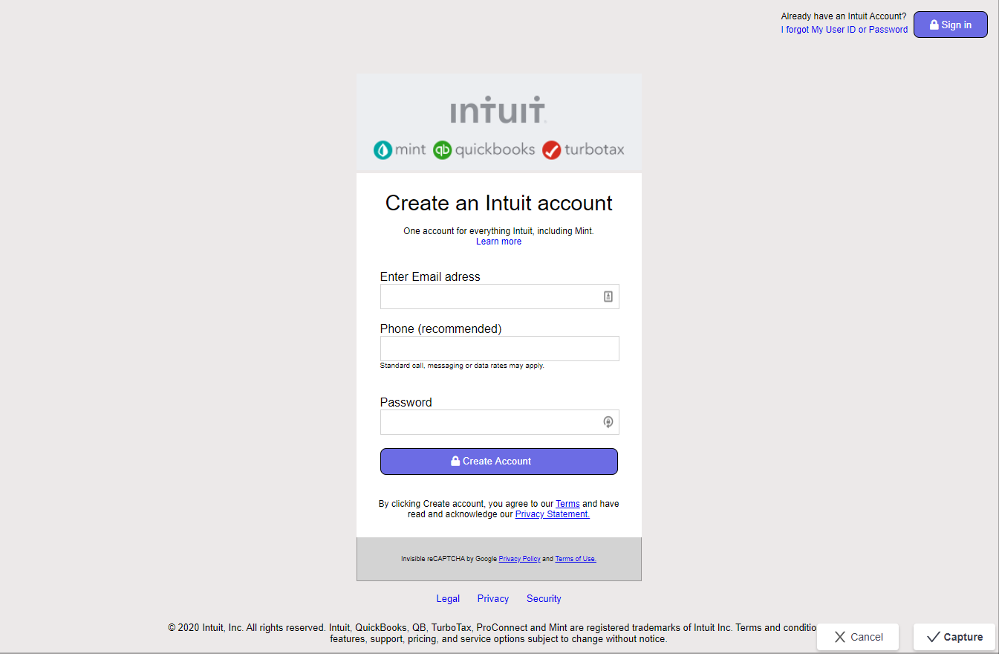

# Mint.com-sign-up-page-clone
* This is a mint.com sign up page clone ( replicate ). 
# project screenshot

* Additional description about the project and its features.
## Built with:
 # majors languages:
* HTML.
* CSS.
# Collaborators
* Njigouh Abdoulaye Razak.
* Clayton Siby.

## Live Demo
https://abdoulaye-thespy.github.io/Mint.com-sign-up-page-clone/

## Authors

👤 **Abdoulaye-Thespy**

- Github: https://github.com/Abdoulaye-Thespy
- Twitter: https://twitter.com/AbdoulayeThe
- Linkedin: https://www.linkedin.com/in/njigouh-abdoulaye-8b02621a4/

👤 **Clayton Siby**

- Github: https://github.com/ClaytonSiby 
- Twitter: https://twitter.com/ClaytonSiby 
- Linkedin: https://www.linkedin.com/in/clayton-siby-48a8a0183/ 

## 🤝 Contributing

Contributions, issues and feature requests are welcome!

Feel free to check the [issues page](issues/).

## Show your support

Give a ⭐️ if you like this project!
